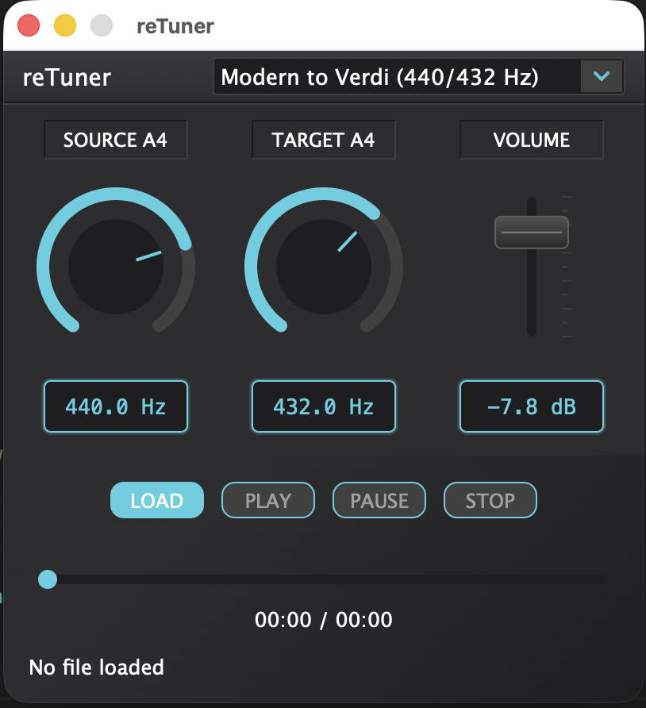

# reTuner

reTuner is a precision audio pitch shifting plugin designed to convert music between different tuning standards. It allows you to seamlessly shift the pitch of audio from one reference frequency (e.g., A440) to another (e.g., A432), preserving the character and formants of the original recording.



Built with [JUCE](https://juce.com/) and [Rubber Band](https://breakfastquay.com/rubberband/).

## Features

- **High-Quality Pitch Shifting**: Uses the Rubber Band Library for artifact-free pitch shifting.
- **Precise Tuning Control**:
  - **Source A4**: Set the reference frequency of your input audio (380Hz - 460Hz).
  - **Target A4**: Set the desired output reference frequency.
- **Multi-Format**: Available as VST3, LV2, CLAP, AU and Standalone application.
- **Cross-Platform**: Compatible with Windows, macOS, and Linux.

## Building

reTuner uses CMake for its build system.

### Prerequisites

- CMake 3.21 or higher
- C++20 compatible compiler
- Ninja (optional, but recommended for faster builds)

#### Submodules
JUCE, CLAP and RubberBand are provided as git submodules, make sure to initialize them:

```bash
git submodule update --init --recursive
```

### Build Instructions

1.  **Configure the project:**

    ```bash
    cmake -B build -G Ninja
    ```
    *(Omit `-G Ninja` if you prefer to use your default generator, e.g., Makefiles or Visual Studio)*

2.  **Build the plugin:**

    ```bash
    cmake --build build
    ```

    This will compile the VST3, LV2, CLAP plugins and the Standalone application.

3.  **Run Tests:**

    ```bash
    ctest --test-dir build
    ```

## Installation
### Linux
Note: You might need `sudo` depending on your prefix:
```sh
cmake --install build
```

### Mac an PC
**WARNING** 
_Do not_ use `cmake --install ...` to install apps and plugins on these platforms.  cmake install for these platforms is set up to work well with cpack, not system installation.  Use at your own peril.

**INSTEAD** 
After building, the artifacts can be found in the `build/reTuner_artefacts` directory for plugins and `build/src/app/reTunerApp_artefacts` for the standalone application. Just manually copy them where you want them.

**OR**
You can use JUCE's [copy plugin options in cmake](deps/JUCE/docs/CMake%20API.md). Search for `COPY_PLUGIN_AFTER_BUILD` in the JUCE docs for details. Note that this option won't copy the standalone application (`reTuner.app` or `reTuner.exe`), and may fail on Windows when copying to system directories.

## License

Copyright (c) 2025 Kushview, LLC.
Licensed under the GPL-3.0-or-later license. See `LICENSE.txt` for details.
